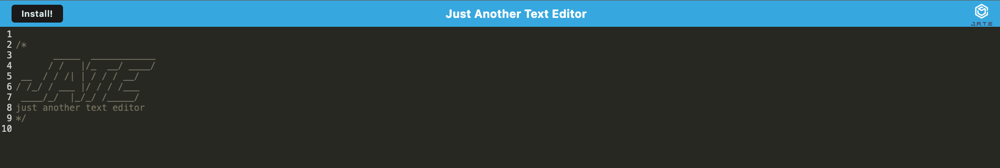

## PWA Code & Text Editor
Overview
The PWD text editor is a text editor that runs in the browser. The app is a single-page application that meets the PWA criteria. Additionally, it features a number of data persistence techniques that serve as redundancy in case one of the options is not supported by the browser. The application will also function offline.

## User Story
AS A developer I WANT to create notes or code snippets with or without an internet connection SO THAT I can reliably retrieve them for later use

## Technologies Used
Node.js
Webpack
HTML / CSS / Javascript

## Usage Guide
Launch Text Editor.
Begin typing your notes or code snippets.
When done, simply navigate away; it will automatically saves your content.
To install the text editor on your desktop, click the "Install" button.
To retrieve saved content, just reopen the application.

## Live Demo
Check out the live version of this project [here insert heroku link]

## Screenshots

